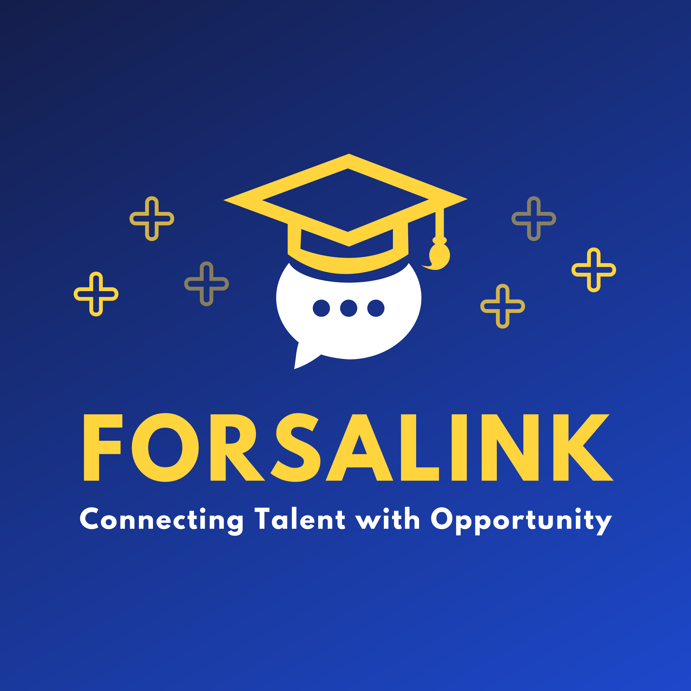

# ForsaLink - **Connecting Talent with Opportunity**

## Introduction

Welcome to ForsaLink! This project aims to create a platform that connects students seeking internships with companies offering valuable opportunities. Our goal is to simplify the process and provide a secure, efficient way to match talent with the right opportunities.

## Project Vision

Over the past two years, many individuals have reached out to me on LinkedIn and WhatsApp, inquiring about internship opportunities. Realizing the need for a streamlined solution, I decided to launch ForsaLink. This initiative will help students find internships by matching them with reputable companies.

## Current Status

We are in the initial stages of developing ForsaLink. The app will start with a simple MVP (Minimum Viable Product) focusing on the core functionality of linking offers and demands through LinkedIn profiles. This ensures no confidential information like phone numbers or addresses is shared, maintaining user privacy.

## Features

- **Profile Matching**: Connect students and companies using LinkedIn profiles.
- **Secure and Private**: No need for phone numbers or addresses, just LinkedIn links.
- **Community-Driven**: Built by a community of developers, marketers, and supporters passionate about making a difference.

## How You Can Help

We are looking for collaborators to join the core team and help bring ForsaLink to life. If you're interested in contributing to web development, deployment, marketing, or any other aspect of the project, we'd love to have you on board.

### Steps to Join

1. **Contact Me**: Reach out to me on [LinkedIn](https://www.linkedin.com/in/halimbahae/) expressing your interest.
2. **Collaborate on GitHub**: Once connected, we will add you to the GitHub repository as a collaborator.
3. **Contribute**: Start contributing to the project. Check the issues tab for tasks or suggest your own improvements.

## Getting Started

To get started with the project, clone the repository and follow the setup instructions:

```bash
git clone https://github.com/your-username/forsalink.git
cd forsalink
```

### Prerequisites

- Node.js
- npm

### Installation

```bash
npm install
```

### Running the App

```bash
npm start
```

## Roadmap

- [x] Create a basic MVP with offer/demand functionality
- [ ] Implement profile matching based on LinkedIn links
- [ ] Develop a user-friendly interface
- [ ] Expand features based on community feedback

## Contact

For any questions or suggestions, feel free to reach out to me on [LinkedIn](https://www.linkedin.com/in/halimbahae/).

## Support Us

You can support us by liking and sharing our [LinkedIn post](https://www.linkedin.com/feed/update/urn:li:activity:7197015537363677184/), helping us spread the word and reach more potential collaborators and users.

## License

This project is licensed under the MIT License.

---

Thank you for your interest in ForsaLink. Together, we can create a platform that makes a real difference in connecting talent with opportunities.
